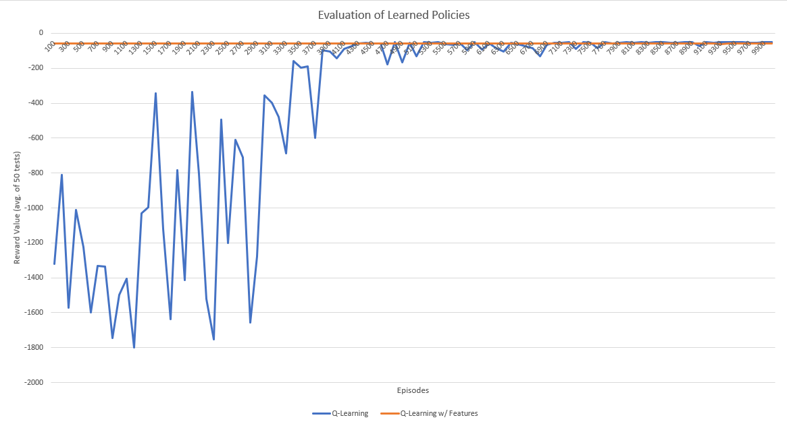

# Q-Learning

This is a simple implementation of a Q-Learning,
the data tested was extracted from a pipe_world.txt file. Q-learning is an algorithm that considers state-action pairs and assigns a weight to a given action for a given state. This policy is tested by updating the weight based on the reward function for that considered choosen state for next transition.

Q(s,a) = Q(s,a) + α ( r + γ maxQ(s',a') - Q(s,a) )

# Q-Learning w/ Features

This is a slightly modified implementation of a Q-Learning algorithm in which features of the dataset are instead considered representing a computed state action pair. Weights are assigned to the entire learning run so each Q-Learning w/ Features training only modifies two weights. The policy for updating the global weights of this function are assigned as normal weight updates pertaining to the given state and features values.

Q-value is calculated for any state-action pair as follows:
Q(s,a) = w · f(s,a) = (w1 * f1) + (w2 * f2)

After each Q-Learning iteration, we update weights:
δ = r + γ maxQ(s',a') - Q(s,a)
∀i, wi = wi + α δ fi(s,a)

### Prerequisites

[Python 3.7](https://www.python.org/downloads/) - programming language version used

## Running the program

The qlearning.py file is the main driver of the program.
It is run using command-line as any typical python file is.
```
python .\qlearning.py
```

Here is the data result of policy selected charted for every 100 episodes of learning, tested 50 times in that learned policy and averaged across those 50 tests for both Q-learning and Q-learning with Features.



## Author

* Author: **Zachary Baklund**
* Date-Last-Modified: *12/18/18*